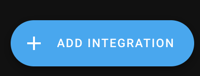
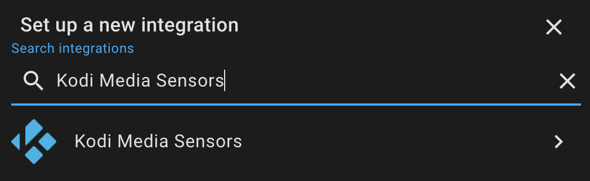
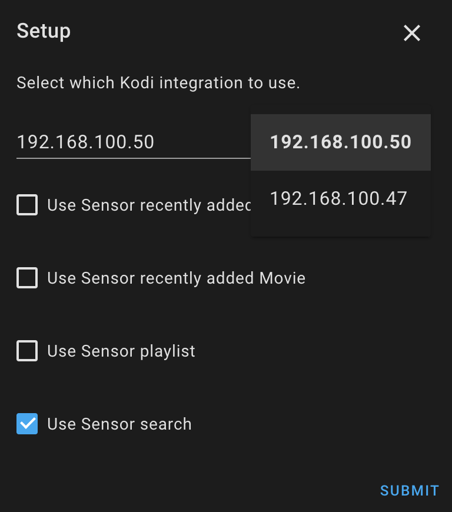
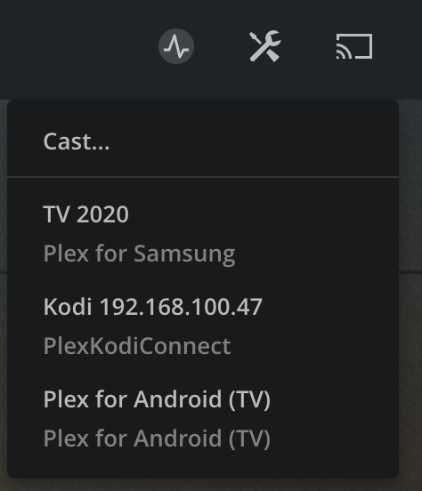

# Detailed Configuration

**type**: 'custom:plex-meets-homeassistant'

**token**: Enter your [Plex Token](https://support.plex.tv/articles/204059436-finding-an-authentication-token-x-plex-token/)

**ip**: Enter ip address of plex server. You can also enter hostname without protocol or port.

**libraryName**: Name of the library you wish to render.

_Available special libraries:_

| Special Library   | Description                                                                                                                 |
| ----------------- | --------------------------------------------------------------------------------------------------------------------------- |
| Watch Next        | Shows Continue Watching feed just like in your new plex interface. **Does not work with old servers.**                      |
| Recently Added    | Shows recently added tv show episodes, might use old Plex API. For recently added movies use sort with your movies library. |
| Continue Watching | Shows movies and tv shows in progress, uses old Plex API.                                                                   |
| Deck              | Shows tv shows on deck, uses old Plex API.                                                                                  |

You can also use Live TV library by specifying its name, usually "Live TV & DVR".

**entity**: You need to configure at least one supported media_player entity.

- **androidtv**: Entity id of your media_player configured via [Android TV](https://www.home-assistant.io/integrations/androidtv/). See [detailed instructions](#android-tv-or-fire-tv). It is also possible to use short declaration with androidtv.
- **kodi**: Entity id of your media_player configured via [Kodi](https://www.home-assistant.io/integrations/kodi/). See [detailed instructions](#kodi). It is also possible to use short declaration with kodi.
- **plexPlayer**: Name or machine ID of your plex client. Use this if you do not have devices above. See [detailed instructions](#all-other-plex-clients). It is required to use detailed declaration with "plexPlayer:" property.
- **cast**: Entity id of your media_player configured via [Google Cast](https://www.home-assistant.io/integrations/cast/). See [detailed instructions](#google-cast). It is also possible to use short declaration with cast.
- **vlcTelnet**: Entity id of your media_player configured via [VLC media player Telnet](https://www.home-assistant.io/integrations/vlc_telnet/). See [detailed instructions](#vlc-media-player-telnet). It is also possible to use short declaration with vlcTelnet.
- **sonos**: Entity id of your media_player configured via [Sonos](https://www.home-assistant.io/integrations/sonos/). See [detailed instructions](#sonos). It is also possible to use short declaration with sonos.
- **input_select**: Entity id of input select you wish to use for selecting media player to play on. State of this entity needs to be entity ID of media player of `androidtv`, `kodi` or `cast`. You can also use this with `plexPlayer`, in that case, provide name or machine ID of your plex client. You can also provide the same string as displayed in entities selection in UI editor for the card (beginning with `plexPlayer |`).
- **input_text**: Entity id of input text you wish to use for selecting media player to play on. State of this entity needs to be entity ID of media player of `androidtv`, `kodi` or `cast`. You can also use this with `plexPlayer`, in that case, provide name or machine ID of your plex client. You can also provide the same string as displayed in entities selection in UI editor for the card (beginning with `plexPlayer |`).

**port**: _Optional_ Port of your plex sever.

**protocol**: _Optional_ Protocol to use for Plex. Defaults to "http".

**maxRows**: _Optional_ Maximum number of rows to display in card. Especially useful when using sidebar card with dock for example.

**maxCount**: _Optional_ Maximum number of items to display in card.

**sort**: _Optional_ Define sort by. See [detailed instructions](#sorting)

**runBefore**: _Optional_ Specify a script to run before playing. This can be for example a script which turns on your TV and waits 5 seconds. If this is specified and provided entity/script exists, all the other play checks for availability of entity are ignored.

**runAfter**: _Optional_ Specify a script to run after playing.

**showExtras**: _Optional_ Specify whether to show extras if any available on movie / episode. Possible values: true, false. Default: true

**showSearch**: _Optional_ Specify whether to show search field on top. Possible values: true, false. Default: true

**playTrailer**: _Optional_ Specify whether to play trailer if available. Possible values: true, false, muted. Default: true

**title**: _Optional_ Title of the card

**useHorizontalScroll:** _Optional_ Specify whether to use horizontal infinite scroll. Possible values: On, Off. Default: Off

**useShuffle:** _Optional_ Specify whether to use shuffle on music. Possible values: On, Off. Default: Off

**displayTitleMain:** _Optional_ Specify whether to display title under poster. Possible values: On, Off. Default: Off

**displaySubtitleMain:** _Optional_ Specify whether to display subtitle under poster. Possible values: On, Off. Default: Off

**fontSize1**: _Optional_ Font size for titles under posters

**fontSize2**: _Optional_ Font size for subtitles under posters

**fontSize3**: _Optional_ Font size for title in opened content

**fontSize4**: _Optional_ Font size for sub-titles, to-view count and description in opened content

**minWidth:** _Optional_ Minimum width of poster image

**minExpandedWidth:** _Optional_ Minimum expanded width of poster when opened

**minExpandedHeight:** _Optional_ Minimum expanded height of poster when opened

**minEpisodeWidth**: _Optional_ Minimum width of image preview of episode

Example of the simplest possible configuration:

```
type: 'custom:plex-meets-homeassistant'
token: QWdsqEXAMPLETOKENqwerty
ip: 192.168.13.37
libraryName: Movies
entity: media_player.bedroom_tv # entity provided by cast integration
```

Example of the simplest possible configuration using multiple entities:

```
type: 'custom:plex-meets-homeassistant'
token: QWdsqEXAMPLETOKENqwerty
ip: 192.168.13.37
libraryName: Movies
entity:
  - media_player.living_room_nvidia_shield # created by androidtv integration
  - media_player.living_room_tv # created by cast integration
  - media_player.bedroom_tv # created by cast integration
  - media_player.kodi_123456qwe789rty # created by kodi integration
  - media_player.vlc_telnet # created by VLC Telnet integration
  - media_player.sonos # created by Sonos integration
```

Example of card configuration using detailed definitions:

**Does not work through configuration UI because of plexPlayer key**

```
type: 'custom:plex-meets-homeassistant'
token: QWdsqEXAMPLETOKENqwerty
ip: 192.168.13.37
port: 32400
libraryName: TV Shows
protocol: http
maxCount: 10
sort: title:desc
entity:
  kodi: media_player.kodi_123456qwe789rty
  androidtv: media_player.living_room_nvidia_shield
  plexPlayer: 192.168.13.38
  cast: media_player.bedroom_tv
  vlcTelnet: media_player.vlc_telnet
  sonos: media_player.sonos
```

Complex example using detailed definitions, lists and shared plex server for plexPlayer:

**Does not work through configuration UI because of plexPlayer key**

```
type: 'custom:plex-meets-homeassistant'
token: QWdsqEXAMPLETOKENqwerty
ip: remote.plex.server.com # remote shared plex instance
port: 443
libraryName: Deck
protocol: https
maxCount: 10
sort: title:desc
runBefore: script.turn_on_tv_and_wait
runAfter: script.movie_time
showExtras: true
playTrailer: muted
entity:
  kodi:
    - media_player.kodi_bedroom
    - media_player.kodi_living_room
  androidtv:
    - media_player.living_room_nvidia_shield
    - media_player.bedroom_nvidia_shield
    - media_player.kithen_nvidia_shield
  plexPlayer:
    - identifier: TV 2020 # plex client device located on local plex server network
      server:
        ip: local.plex.server.com # Mandatory
        token: QWdsqEXAMPLETOKENqwerty # Mandatory
        port: 32400
        protocol: http
    - 192.168.13.50 # without definition for server, it will look for device on remote.plex.server.com network
  cast: media_player.bedroom_tv
```

In this example, it will try to first play via kodi, in bedroom. If that kodi is unavailable or off, it tries in living room kodi.
If that fails, it moves on to android tvs, starting with living room, continuing with bedroom and ending with kitchen.
Next, if a possible player still has not been found (all kodis and shields are off) it tries to play via plexPlayer, trying TV 2020 on local plex server and if not found, IP 192.168.13.50 on remote plex server.
Finally, it tries to cast into media_player.bedroom_tv.

## Detailed configuration instructions for end devices

**Unless you have a specific need to configure this part manually, such as remote plex server for plexPlayer, it is strongly advised to use UI to configure entities.**

_You can combine multiple supported entities_, in that case, entity for supported content will be chosen in order how you entered them.

As an example, if content can be played / shown both by kodi and androidtv, and you entered kodi first, it will be shown by kodi. If it cannot be played by kodi but can be played by androidtv, androidtv will be used.

This will also work with play button being shown, it will only show when you can actually play content on your device.

Play button is only visible if all the conditions inside Availability section of end devices below are met.

### Android TV or Fire TV

**Difficulty to setup**: Easy

**Steps**:

- Install plex application on your Android TV device. Open it and do the default setup so that you can see and navigate your libraries.
- Setup [Android TV](https://www.home-assistant.io/integrations/androidtv/). You need just a [default configuration](https://www.home-assistant.io/integrations/androidtv/#configuration), no optional parameters needed.
- Use entity_id of media_player provided by Android TV integration in card, example: `androidtv: media_player.living_room_nvidia_shield`.

**Availability**:

- Provided entity ID needs to exists
- Provided entity ID needs to have attributes
- Provided entity ID needs to have attribute adb_response

**Supported**:

✅ Shared Plex servers

✅ Movies

✅ Show

✅ Season

✅ Episodes

✅ Artists

✅ Albums

✅ Tracks

❌ Live TV

### Kodi

**Difficulty to setup**: Moderate

**Steps**:

- Install and configure [PlexKodiConnect](https://github.com/croneter/PlexKodiConnect#download-and-installation) on Kodi itself.
- Setup [Kodi](https://www.home-assistant.io/integrations/kodi/) integration for your device.
- Install and configure integration [Kodi Recently Added Media](https://github.com/jtbgroup/kodi-media-sensors#installation) and its sensor **kodi_media_sensor_search**. For support of Live TV, if [this PR](https://github.com/jtbgroup/kodi-media-sensors/pull/5) has not been merged yet, you need to use [this modified](https://github.com/JurajNyiri/kodi-media-sensors/tree/add_channels_search) integration with support for PVR.

<details>
    <summary>Images of installation of Kodi Recently Added Media</summary>







</details>

- Use entity_id of media_player provided by Kodi integration in card, example: `media_player.kodi_123456qwe789rty`.

**Availability**:

- Provided entity ID needs to exists
- Entity 'sensor.kodi_media_sensor_search' needs to exist
- State of both entities cannot be 'unavailable'
- State of kodi cannot be 'off'

**Supported**:

✅ Shared Plex servers _\*if content available in kodi_

✅ Movies

❌ Show

❌ Season

✅ Episodes

❌ Artists

❌ Albums

❌ Tracks

✅ Live TV

### Google Cast

**Difficulty to setup**: Very easy

**Steps**:

- Set up [Google Cast](https://www.home-assistant.io/integrations/cast/) in Home Assistant.
- Use entity_id of media_player provided by Google Cast integration in card, example: `cast: media_player.bedroom_tv`.
- Save card configuration and make sure the entity is not `unavailable`, if you see play buttons on movies or individual episodes configuration was successful.

**Availability**:

- Media player entity cannot be `unavailable`

**Supported**:

✅ Shared Plex servers

✅ Movies

❌ Show

❌ Season

✅ Episodes

✅ Artists

✅ Albums

✅ Tracks

❌ Live TV

### VLC media player Telnet

**Difficulty to setup**: Moderate

**Steps**:

- Set up [VLC media player Telnet](https://www.home-assistant.io/integrations/vlc_telnet/) in Home Assistant.
- Use entity_id of media_player provided by VLC media player Telnet integration in card, example: `cast: media_player.vlc_telnet`.
- Save card configuration and make sure the entity is not `unavailable`, if you see play buttons on music tracks configuration was successful.

**Availability**:

- Media player entity cannot be `unavailable`

**Supported**:

✅ Shared Plex servers

❌ Movies

❌ Show

❌ Season

❌ Episodes

❌ Artists

❌ Albums

✅ Tracks

❌ Live TV

### Sonos

**Difficulty to setup**: Easy

**Steps**:

- Have Plex Pass
- Set up [Sonos](https://www.home-assistant.io/integrations/sonos/) in Home Assistant.
- Set up [Plex](https://www.home-assistant.io/integrations/plex/) in Home Assistant.
- Use entity_id of media_player provided by Sonos integration in card, example: `cast: media_player.sonos`.
- Save card configuration and make sure the entity is not `unavailable`, if you see play buttons on music configuration was successful.

**Availability**:

- Media player entity cannot be `unavailable`

**Supported**:

✅ Shared Plex servers

❌ Movies

❌ Show

❌ Season

❌ Episodes

✅ Artists

✅ Albums

✅ Tracks

❌ Live TV

### All other plex clients

**Difficulty to setup**: Very Easy to Moderate

**Steps**:

_Easy setup_:

Notice: While easy, it might not work if you have multiple devices with the same name, or you buy a second device with the same name in the future. Some plex clients also incorrectly report theirs IP Address, so addition by that might not be working. Take a look at Machine ID setup below if this is a concern for you.

- Open Plex app on the device you wish to add
- Open your Plex web GUI
- Click on cast on the top right corner and note down name of your device



- Add it to card, example:

```
entity:
  plexPlayer: TV 2020
```

Instead of device name, you can also enter device IP address or product name.

- Save card configuration, if you see play buttons everywhere configuration was successful.

If you do not see play button, or have multiple devices with the same name, follow Machine ID setup below.

_Machine ID setup_:

- Open Plex app on the device you wish to add
- Open your Plex web GUI
- Modify URL so that just after the port, just after the first slash, you enter `clients?X-Plex-Token=PLEX_TOKEN`. Replace PLEX_TOKEN with your plex token. Example final URL `http://192.168.13.37:32400/clients?X-Plex-Token=qweRTY123456`.
- You will get a list of all currently connected Plex clients.
- Find the client you wish to add, and copy machineIdentifier key without quotes.
- Add machineIdentifier into card, for example:

```
entity:
  plexPlayer: mYaweS0meMacHin3Id3ntiFI3r
```

- Save card configuration, if you see play buttons everywhere configuration was successful.

**Availability**:

- Plex needs to run on the defined device

**Supported**:

✅ Shared Plex servers _\*requires additional configuration, see below_

✅ Movies

✅ Show

✅ Season

✅ Episodes

✅ Artists

✅ Albums

✅ Tracks

❌ Live TV

**Shared Plex servers configuration**

plexPlayer can be configured in multiple ways, achieving the same thing:

```
entity:
  plexPlayer: TV 2020
```

```
entity:
  plexPlayer:
    - TV 2020
```

```
entity:
  plexPlayer:
    identifier: TV 2020
```

```
entity:
  plexPlayer:
    - identifier: TV 2020
```

As can be seen from the last two examples, it is possible to configure it as an object having key "identifier".

That is useful, if you want to stream media from shared or remote Plex server. Add information about your local Plex server which sees your device on which you wish to play content. This is done by including a new key, "server" having additional keys:

Example 1:

```
entity:
  plexPlayer:
    - identifier: TV 2020
      server:
        ip: 192.168.13.37 # Mandatory
        token: QWdsqEXAMPLETOKENqwerty # Mandatory
        port: 32400
        protocol: http
```

Example 2:

```
entity:
  plexPlayer:
    identifier: TV 2020
    server:
      ip: 192.168.13.37 # Mandatory
      token: QWdsqEXAMPLETOKENqwerty # Mandatory
      port: 32400
      protocol: http
```

## Sorting

You can use _:desc_ or _:asc_ after every value to change the order from ascending to descending. For example, titlesort would become titleSort:asc, or titleSort:desc.

### TV Shows

| Sort Value            | Description                                       |
| --------------------- | ------------------------------------------------- |
| titleSort             | Sorts by title, removing words like "the"         |
| title                 | Sorts by title, without removing words like "the" |
| year                  | Sorts by year                                     |
| originallyAvailableAt | Sorts by release date                             |
| rating                | Sorts by critic rating                            |
| audienceRating        | Sorts by audience rating                          |
| userRating            | Sorts by user rating                              |
| contentRating         | Sorts by content rating                           |
| unviewedLeafCount     | Sorts by unplayed count                           |
| episode.addedAt       | Sorts by last episode date added                  |
| addedAt               | Sorts by date added                               |
| lastViewedAt          | Sorts by date viewed                              |

### Movies

| Sort Value            | Description                                       |
| --------------------- | ------------------------------------------------- |
| titleSort             | Sorts by title, removing words like "the"         |
| title                 | Sorts by title, without removing words like "the" |
| originallyAvailableAt | Sorts by release date                             |
| rating                | Sorts by critic rating                            |
| audienceRating        | Sorts by audience rating                          |
| userRating            | Sorts by user rating                              |
| duration              | Sorts by duration                                 |
| viewOffset            | Sorts by progress                                 |
| viewCount             | Sorts by plays                                    |
| addedAt               | Sorts by date added                               |
| lastViewedAt          | Sorts by date viewed                              |
| mediaHeight           | Sorts by resolution                               |
| mediaBitrate          | Sorts by bitrate                                  |
