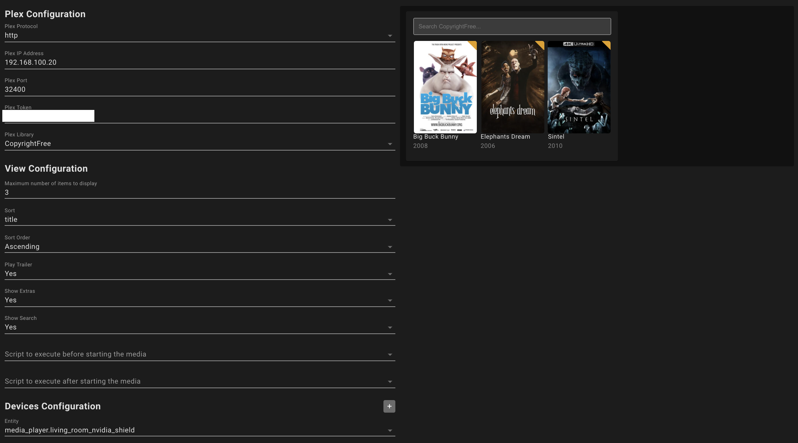

# PlexMeetsHomeAssistant

Custom Home Assistant card which integrates plex into Home Assistant and makes it possible to launch movies or tv shows on TV with a simple click.

Supported are **ALL** Plex clients, some even with enhanced functionality. Kodi with PlexKodiConnect, Android TV, VLC via Telnet and Google Cast is also supported.

Video of the card:

More images [at the end of the readme](https://github.com/JurajNyiri/PlexMeetsHomeAssistant#images).

## Important notice

**If you are using Home Assistant via HTTPS, you need to specify port `https` for Plex and have Plex available on https connection.**

## Installation

- Install **Plex Meets Home Assistant** from HACS.
- Reload browser, clear cache as usual
- Create a new Home Assistant tab, turn on panel mode
- Add a card by clicking Add Card in your lovelace edit mode and finding "Custom: Plex Meets Home Assistant"

## Configuration

You can use UI to configure your card which will automatically load up your libraries and entities. If you wish, you can use card code to configure everything manually. See [Detailed Configuration](DETAILED_CONFIGURATION.md) if you wish to see a lot more information about every property of the card.

Supported target devices are all entities from integrations [Android TV](https://www.home-assistant.io/integrations/androidtv/), [Kodi](https://www.home-assistant.io/integrations/kodi/), [Google Cast](https://www.home-assistant.io/integrations/cast/) and any other Plex player available for casting through Plex web interface.

### Regarding "all other plex players" without entities

In order for devices which do not have entities to be detected, they need to have plex app running when configuring the card or trying to play content.

If you are trying to play content on a local device from a remote Plex server **or** trying to play local Plex content on a remote device, you need to configure identifier and server for this device. This can only be done manually through card code configuration. See [Detailed Configuration - All other plex clients](DETAILED_CONFIGURATION.md#all-other-plex-clients). You can still use UI to edit anything else except entities while manually using plexPlayer key in entities.

### Quick guides:

- [Guide How to get Plex Token](https://support.plex.tv/articles/204059436-finding-an-authentication-token-x-plex-token/)
- Play icon will only show up when playing is possible.
- Kodi entities will only work if you are using [PlexKodiConnect](https://github.com/croneter/PlexKodiConnect#download-and-installation) and [Kodi Recently Added Media](https://github.com/jtbgroup/kodi-media-sensors#installation) is installed. See [detailed instructions](DETAILED_CONFIGURATION.md#kodi)
- If you have Plex integration set up, Plex player is used for cast entities. Otherwise media is casted as a file.

## Ask for help or help development

Join [Discord](https://discord.gg/jqqz9jQXWx) or [Home Assistant Community](https://community.home-assistant.io/t/custom-component-card-plex-meets-home-assistant/304349).

## Images

# Want to buy me a beer?

# Disclaimer

Author is in no way affiliated with Kodi, Plex, Roku, Android TV, Google or any other companies mentioned above.

Author does not guarantee functionality of this card and is not responsible for any damage.

All product names, trademarks and registered trademarks in this repository, are property of their respective owners.

This card provides user interface for navigating plex library and playing plex content on users devices. It does not host any content on its own and does not provide any plex server.
